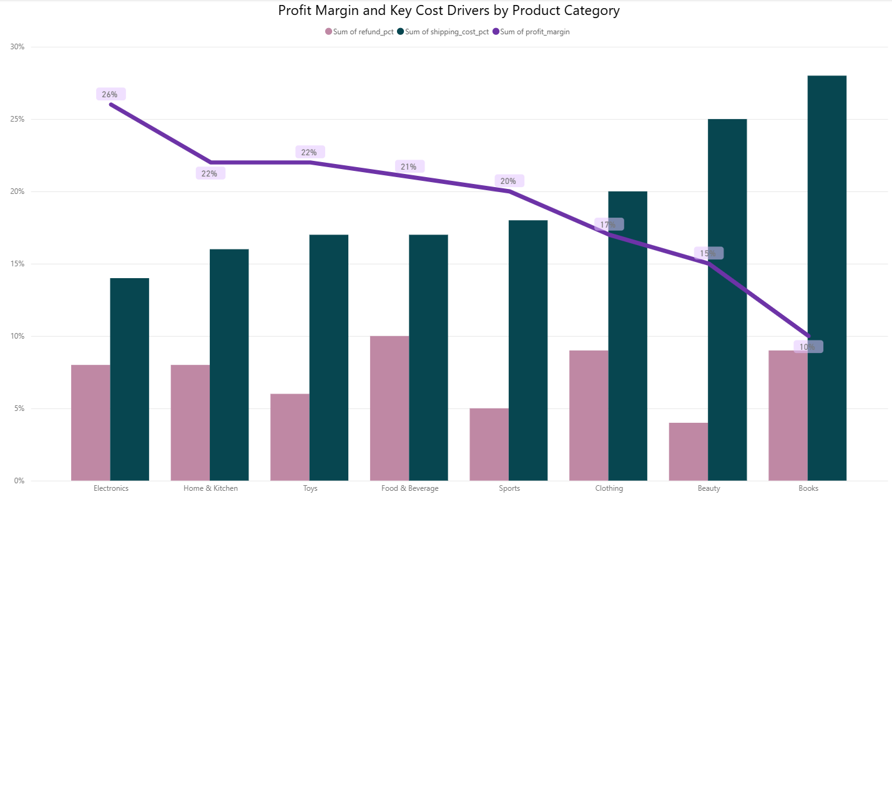
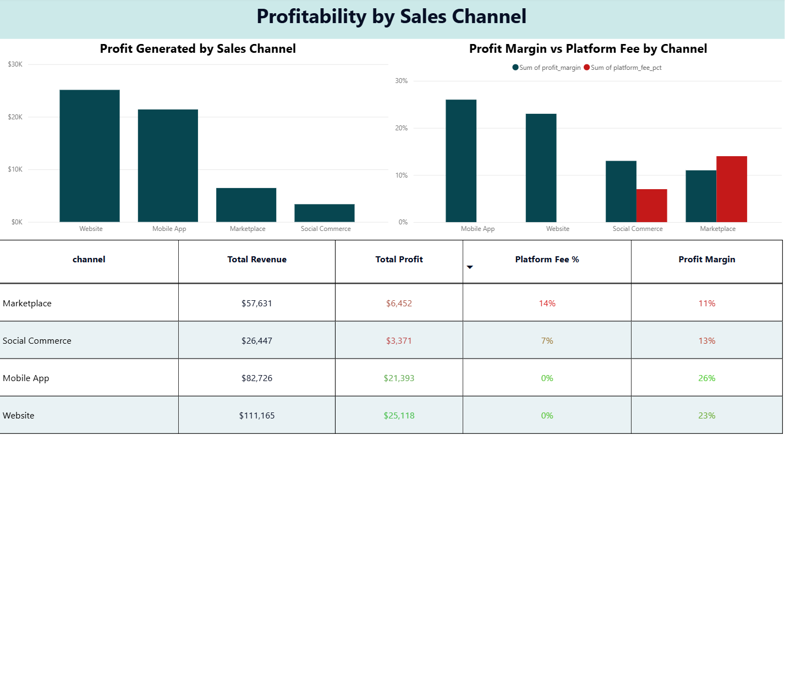
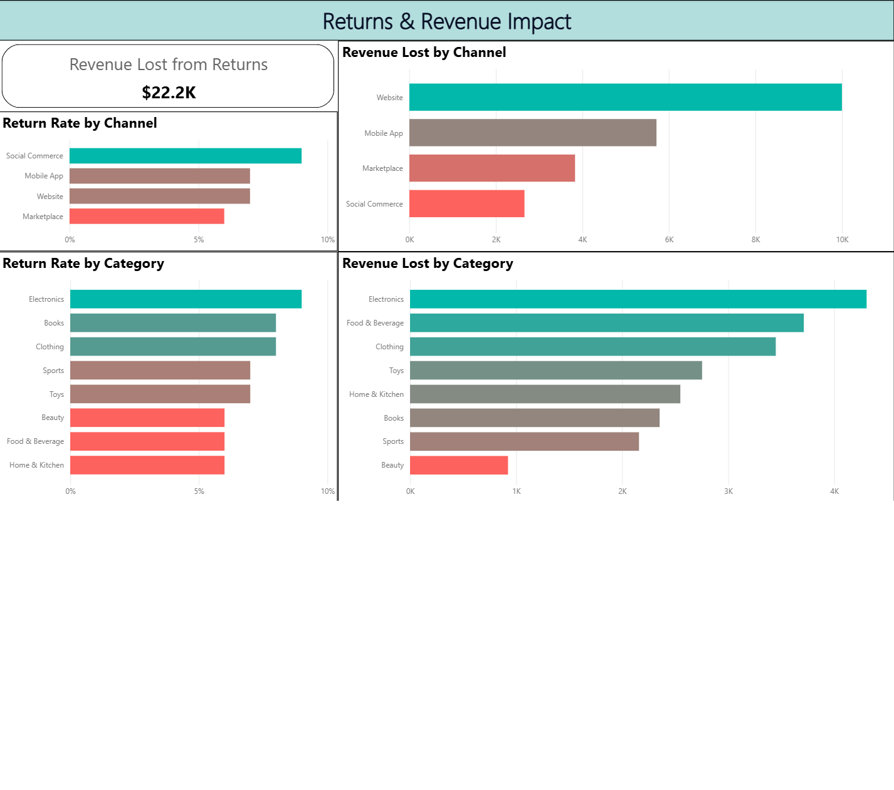
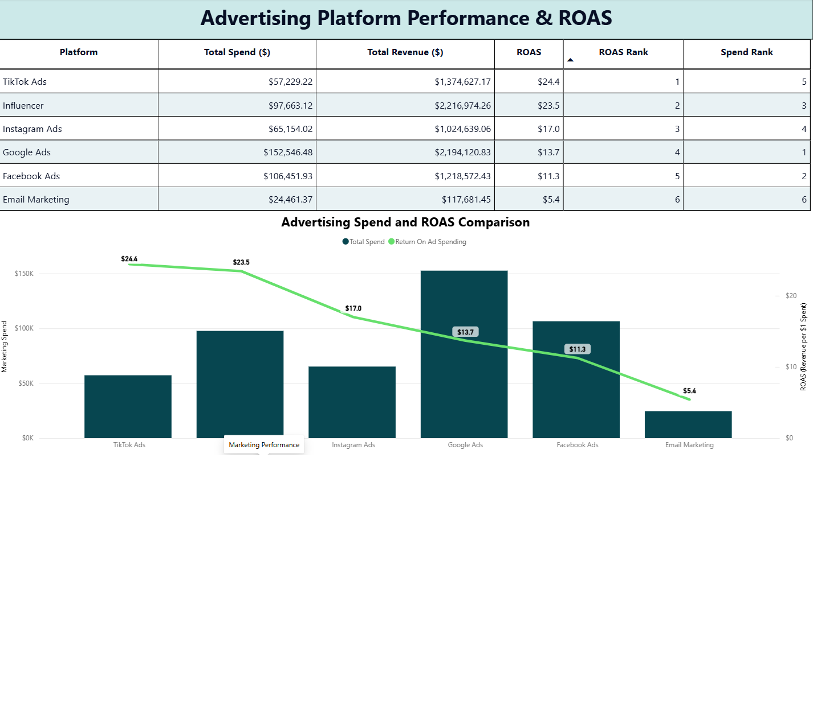
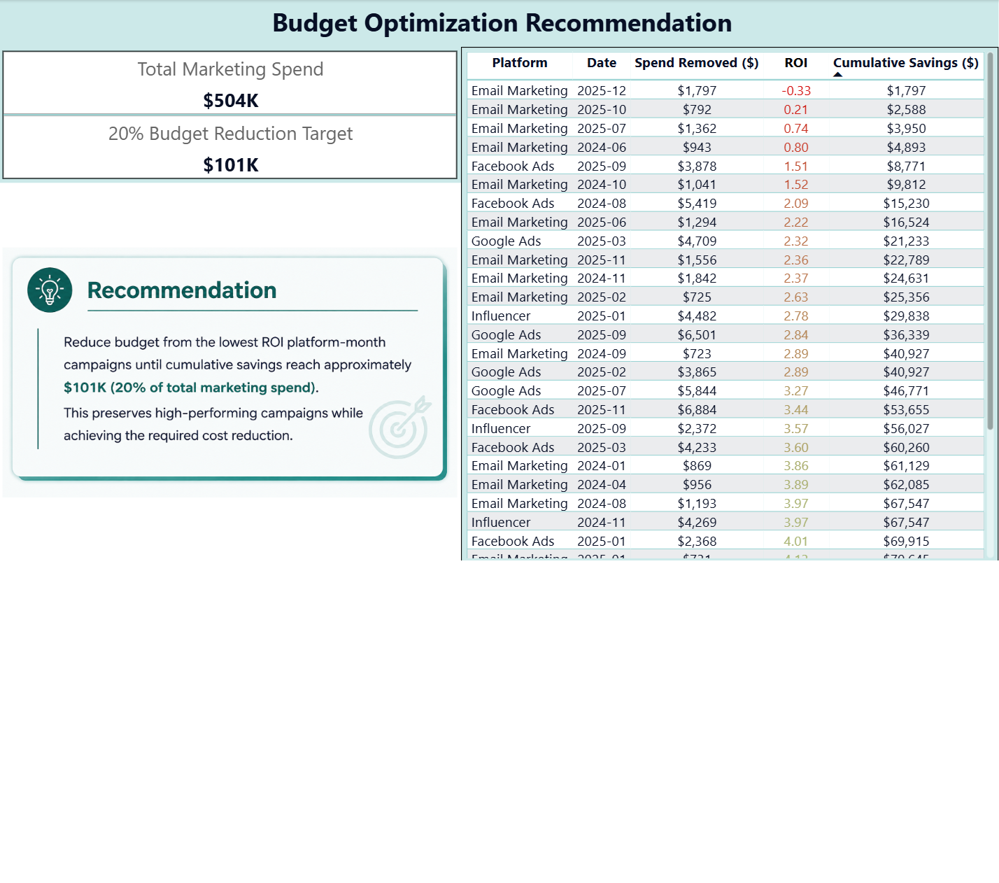

# 📊 BrightCart E-Commerce Analytics

**End-to-End Business Intelligence Project using SQL, Power BI, and Business Reporting**

---

# 📌 Project Overview

BrightCart is a simulated e-commerce company seeking to understand the key drivers of profitability across products, sales channels, and marketing platforms.

The objective of this project is to transform raw transactional and marketing data into actionable business insights using SQL for analysis and Power BI for interactive visualization.

The project focuses on identifying:

- Most profitable product categories
- Cost drivers reducing profit margins
- Product return behavior
- Sales channel performance
- Marketing platform effectiveness
- Campaign ROI optimization

---

# 🎯 Business Questions

This analysis answers the following business questions:

1. Which product categories generate the highest profit?
2. What costs reduce profitability the most?
3. Which categories suffer the highest return rates?
4. Which sales channels perform best financially?
5. Which sales channels experience the greatest revenue loss from returns?
6. Which marketing platforms deliver the highest ROAS and acquisition efficiency?
7. Which campaigns should be reduced first to maximize marketing ROI?

---

# 🛠 Technologies Used

| Technology | Purpose |
|------------|---------|
| SQL (MySQL) | Data analysis and business queries |
| Power BI | Dashboard development |
| Power Query | Data preparation |
| DAX | KPI calculations |
| Microsoft Word | Executive business report |
| Git & GitHub | Version control and portfolio |

---

# 📂 Project Structure

```text
BrightCart-Ecommerce-Analytics
│
├── SQL
│   ├── create_views.sql
│   └── business_queries.sql
│
├── Dashboard
│   └── BrightCart Dashboard.pbix
│
├── Report
│   ├── Executive Report.pdf
│   └── Executive Report.docx
│
├── Images
│   ├── dashboard_overview.png
│   ├── category_profitability.png
│   ├── sales_channel_analysis.png
│   ├── returns_analysis.png
│   ├── marketing_performance.png
│   └── budget_optimization.png
│
└── README.md
```

---

# 📈 Dashboard Overview

The Power BI dashboard includes:

### 📊 Product Profitability

- Revenue by Category
- Profit Margin
- Product Cost %
- Shipping Cost %
- Refund %
- Return Rate

### 🛒 Sales Channel Analysis

- Revenue by Channel
- Profit by Channel
- Average Profit per Order
- Platform Fee Comparison

### 🔄 Returns Analysis

- Return Rate by Category
- Return Rate by Channel
- Revenue Lost from Returns

### 📣 Marketing Performance

- ROAS
- CPA
- CPC
- Marketing Spend
- Revenue Attribution

### 💰 Budget Optimization

- Campaign ROI
- Cumulative Budget Reduction
- Budget Cut Recommendation

---

# 📊 Key Findings

## Product Categories

- Electronics generated the highest profit margin (26%).
- Books produced the lowest profitability (10%).
- Shipping costs significantly reduced margins for Books and Beauty products.

## Sales Channels

- Mobile App delivered the highest profit margin.
- Website generated the highest total revenue.
- Marketplace showed the lowest profitability due to platform fees.

## Returns

- Electronics recorded the highest return rate (9%).
- Website generated the greatest revenue loss from returned orders.
- Social Commerce experienced the highest return rate among sales channels.

## Marketing

- TikTok Ads achieved the highest ROAS.
- Influencer Marketing delivered excellent performance.
- Email Marketing recorded the lowest ROAS and the highest CPA and CPC.

---

# 💡 Business Recommendations

### 1. Optimize Marketing Budget

Reallocate marketing budget from low-performing campaigns to high-ROAS platforms such as TikTok Ads and Influencer Marketing.

### 2. Improve Low-Margin Categories

Reduce shipping costs and optimize pricing strategies for Books and Beauty products.

### 3. Reduce Product Returns

Improve product descriptions and customer experience to reduce returns, especially for Electronics and Social Commerce.

---

# 📸 Dashboard Preview

### Product Profitability



### Sales Channel Analysis



### Returns Analysis



### Marketing Performance



### Budget Optimization



---

# 📑 Executive Report

The project includes a complete business report containing:

- Executive Summary
- SQL Analysis
- Power BI Dashboards
- Business Insights
- Strategic Recommendations

---

# 📌 Skills Demonstrated

- SQL Aggregation
- Window Functions
- Common Table Expressions (CTEs)
- Business KPI Development
- Data Modeling
- Power BI Dashboard Design
- DAX Measures
- Executive Reporting
- Business Analytics
- Data Storytelling

---

# 👨‍💻 Author

**Parsa Younessotoodeh**

Master's Student in Computer Science  
University of Milan

### Interests

- Data Analytics
- Business Intelligence
- SQL
- Power BI
- Data Visualization

**GitHub:** https://github.com/ParsaYSotoodeh

---

# ⭐ Project Highlights

- ✔ End-to-End Business Intelligence Workflow
- ✔ Business-Oriented SQL Analysis
- ✔ Interactive Power BI Dashboard
- ✔ Executive Business Report
- ✔ Data-Driven Business Recommendations
